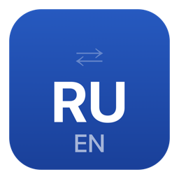

# RuSwitcher

<p align="center">
  
</p>

<p align="center">
  <b>Lightweight keyboard layout switcher for macOS</b><br>
  Free and open-source alternative to PuntoSwitcher
</p>

<p align="center">
  <b>Легковесный переключатель раскладки для macOS</b><br>
  Бесплатная замена PuntoSwitcher с открытым кодом
</p>

<p align="center">
  <a href="https://github.com/rashn/RuSwitcher/releases/latest"></a>
  <a href="LICENSE"></a>
  
  
</p>

---

## How it works / Как работает

| Action / Действие | Result / Результат |
|---|---|
| Type a word, tap **⌥ Alt** | Last word converted / Последнее слово сконвертировано |
| Tap **⌥ Alt** again | Reverse conversion / Обратная конвертация |
| Select text, tap **⌥ Alt** | Selected text converted / Выделенный текст сконвертирован |

Typed `ghbdtn` instead of `привет`? Just tap **⌥ Alt**.

Набрали `ghbdtn` вместо `привет`? Просто нажмите **⌥ Alt**.

## Features / Возможности

- **Any two layouts / Любая пара раскладок** — Russian, Ukrainian, Belarusian, German, French, or any other pair. Русская, украинская, белорусская, немецкая и любая другая пара.

- **Smart word detection / Умное определение слова** — converts the last typed word including punctuation. Конвертирует включая знаки препинания.

- **Selected text / Выделенный текст** — select text and tap Alt to convert. Выделите текст и нажмите Alt для конвертации.

- **Double Alt / Повторный Alt** — reverse conversion if you changed your mind. Обратная конвертация.

- **12 interface languages / 12 языков интерфейса** — English, Русский, Українська, Беларуская, Deutsch, Français, Español, Português, Polski, 中文, 日本語, 한국어

- **Auto-start at login / Автозапуск** — set and forget. Настроил и забыл.

- **Minimal resources / Минимальное потребление** — no Electron, no web views, pure Swift + AppKit. Чистый Swift, минимум ресурсов.

- **No telemetry / Без телеметрии** — your keystrokes stay on your Mac. Ваши данные остаются на вашем Mac.

## Installation / Установка

### Download / Скачать

Download the latest `.dmg` from [**Releases**](https://github.com/rashn/RuSwitcher/releases/latest), open it and drag RuSwitcher to Applications.

Скачайте `.dmg` из [**Releases**](https://github.com/rashn/RuSwitcher/releases/latest), откройте и перетащите RuSwitcher в Программы.

### Build from source / Сборка из исходников

```bash
git clone https://github.com/rashn/RuSwitcher.git
cd RuSwitcher
swift build -c release
bash build_app.sh
cp -R RuSwitcher.app /Applications/
```

Requires macOS 13+ and Xcode Command Line Tools.

Требуется macOS 13+ и Xcode Command Line Tools.

## Permissions / Разрешения

On first launch, RuSwitcher will request two macOS permissions:

При первом запуске RuSwitcher запросит два разрешения macOS:

1. **Accessibility / Универсальный доступ** — to read and modify text in applications. Для чтения и изменения текста в приложениях.
2. **Input Monitoring / Мониторинг ввода** — to detect keyboard events. Для отслеживания клавиатуры.

The app adds itself to the permission lists automatically — you just need to flip the toggle.

Программа автоматически добавляется в списки — вам нужно только включить тумблер.

## Technical details / Технические детали

- `CGEventTap` (passive, listen-only) for keyboard monitoring / для мониторинга клавиатуры
- `UCKeyTranslate` (Carbon) for dynamic character mapping between any layout pair / для динамического маппинга символов
- `CGEventSource.userData` marker to filter simulated events / маркер для фильтрации симулированных событий
- `AXUIElement` API for focused element detection / для определения элемента в фокусе
- `SMAppService` for login item management / для управления автозапуском
- No hardcoded layout tables — works with any installed layouts / Без захардкоженных таблиц — работает с любыми установленными раскладками

## Settings / Настройки

Access via the menu bar icon → Settings (⌘,)

Доступ через иконку в меню → Настройки (⌘,)

- **General / Общие** — auto-switch, launch at login, interface language, layout pair / автопереключение, автозапуск, язык интерфейса, пара раскладок
- **About / О программе** — version, donate, contact, check updates / версия, донат, контакт, проверка обновлений
- **Advanced / Дополнительно** — debug logging, log management / режим отладки, управление логами

## Support the project / Поддержать проект

If you find RuSwitcher useful / Если RuSwitcher вам полезен:

- [**Boosty**](https://boosty.to/ruswitcher) — donate / донат
- **Star** this repo on GitHub / Поставьте звезду на GitHub

## License / Лицензия

[MIT](LICENSE) — free to use, modify, and distribute. Свободное использование, модификация и распространение.
